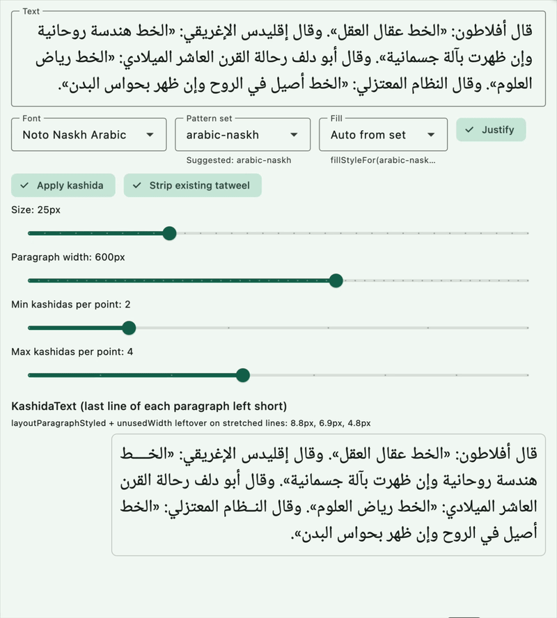

# kashida

A Dart port of [raqim-kashida](https://github.com/aliftype/raqim-kashida): find
_kashida_ (_tatweel_, U+0640) insertion points and priorities in Arabic and
Syriac text, driven by a small pattern language.

Given a string and a compiled pattern set, the package finds connections
that may take a kashida and a priority from 0–9 (higher is better). Detection
is based on text analysis and kashida rules. It does **not** take fonts or
shaping into account by itself.

There are three separate steps:

1. **Find points** — `findKashidaPoints`
2. **Insert a fixed number of tatweels at every point** — `insertKashida`
   (not justification)
3. **Wrap to a width and fill by priority** — `layoutParagraph`,
   `layoutParagraphStyled`, or the `KashidaText` widget

`KashidaPoint.index` is a **grapheme** index. Do not pass it to
`substring`; use `point.endOffsetIn(text)` or `insertKashidaAt`.

For background, see Khaled Hosny’s
[introduction to raqim-kashida](https://aliftype.com/blog/introducing-raqim-kashida/english)
and the
[interactive demo](https://aliftype.com/raqim-kashida/english/).

## Demo

The example’s **Justify** tab: pick a face and a pattern set, then fill a
pixel width. Last line of each paragraph stays short unless **Justify last
line** is on.



## Features

- Compile pattern text, including `use` of a built-in set
- Built-in sets: `arabic-naskh`, `arabic-nastaliq`, `arabic-simple`, `syriac`
- Optional stripping of bare tatweels (mark-seated tatweels are kept)
- Insert tatweel into a string (`insertKashida`) without choosing a font
- Wrap and fill lines given a width and a `measure` callback
- Grapheme-cluster indices, joining analysis, and rasm folding matching the
  original library
- A Flutter example with three tabs (justify, find & insert, custom rules);
  Arabic and Syriac faces are bundled so they work on macOS and web

## Getting started

Add the package to your `pubspec.yaml`:

```yaml
dependencies:
  kashida: ^0.0.3
```

Then:

```dart
import 'package:kashida/kashida.dart';
```

## Usage

```dart
import 'package:kashida/kashida.dart';

void main() {
  final set = requiredBuiltinPatternSet('arabic-simple');

  final found = findKashidaPoints('بيت', set);
  for (final point in found.points) {
    print('${point.priority} @ grapheme ${point.index}');
  }

  // Same count at every allowed join — not a justified line.
  print(insertKashida('بيت', set));
}
```

`findKashidaPointsIn` (also named `findKashidaPointsPatterns`) skips stripping.

To justify to a pixel width in Flutter:

```dart
final set = requiredBuiltinPatternSet('arabic-naskh');

// Widget: leftover space goes between words.
KashidaText(
  paragraph,
  patternSet: set,
  width: 320,
  style: const TextStyle(fontSize: 22),
);

// Or measure yourself:
final lines = layoutParagraphStyled(
  paragraph,
  set,
  const TextStyle(fontSize: 22),
  width: 320,
);
```

A `measure` callback is the font hook if you are not using Flutter painting:

```dart
layoutParagraph(
  paragraph,
  set,
  width: 320,
  measure: (line) => /* width of line in the same units as 320 */,
);
```

Custom rules can extend or override a built-in set:

```dart
final set = compilePatternText('''
use arabic-naskh
* 2 @Heh .
''');
```

The pattern language is the same as upstream. See the
[raqim-kashida README](https://github.com/aliftype/raqim-kashida#pattern-sets)
for the grammar, length guards, priorities, and `!` suppression.

### Built-in pattern sets

| Name | Intended for |
| --- | --- |
| `arabic-naskh` | Classical naskh and naskh-like faces |
| `arabic-nastaliq` | Nastaliq (naskh rules plus nastaliq tailoring) |
| `arabic-simple` | Simple / kufic-style faces (Microsoft-style newspaper rules) |
| `syriac` | Syriac, following the LibreOffice / expert guidelines |

`requiredBuiltinPatternSet(name)` is the usual lookup (throws if unknown).
`builtinPatternSet(name)` returns `null` instead, for probing names.

### Example app

`example/` is a three-tab playground for the public API:

1. **Justify** — `KashidaText` / `layoutParagraphStyled` fills a pixel width
2. **Find & insert** — `findKashidaPoints`, `insertKashida`, `layoutParagraph`
3. **Rules** — `compilePatternText`, built-in lookup, `CompileError`

Arabic and Syriac faces are bundled in `example/fonts/` (OFL) so they load on
macOS as well as web, with no runtime Google Fonts download. Switching to the
Syriac pattern or Noto Sans Syriac loads a Syriac sample.

```sh
cd example
flutter run
```

## Acknowledgements

This package is a Dart/Flutter port of
[raqim-kashida](https://github.com/aliftype/raqim-kashida) by
[Khaled Hosny](https://github.com/khaledhosny) and
[Alif Type](https://aliftype.com/).

Thank you to Khaled and everyone behind raqim-kashida for the research, the
pattern language, the built-in rule sets, and the tests this port follows.
Any mistakes in the Dart implementation are ours.

## Additional information

Issues and contributions are welcome on the package repository. Please include
a small Arabic or Syriac sample and the pattern set name when reporting
justification or matching bugs.

Insertion is U+0640. Filling a pixel width needs a font-aware `measure`
or `KashidaText`. Leftover space thinner than one tatweel is returned as
`unusedWidth` and spread between words by the widget.
